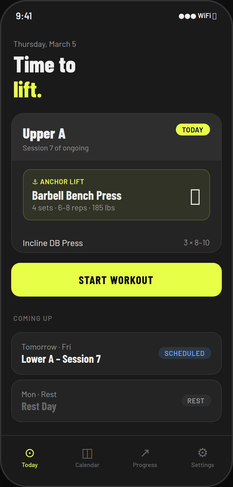
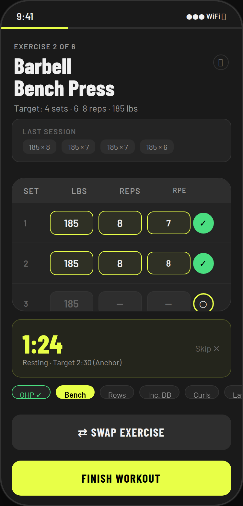
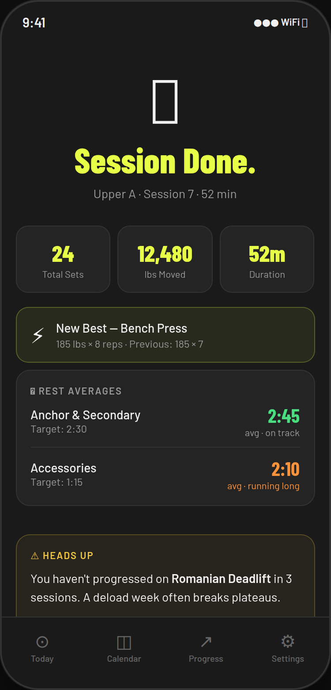
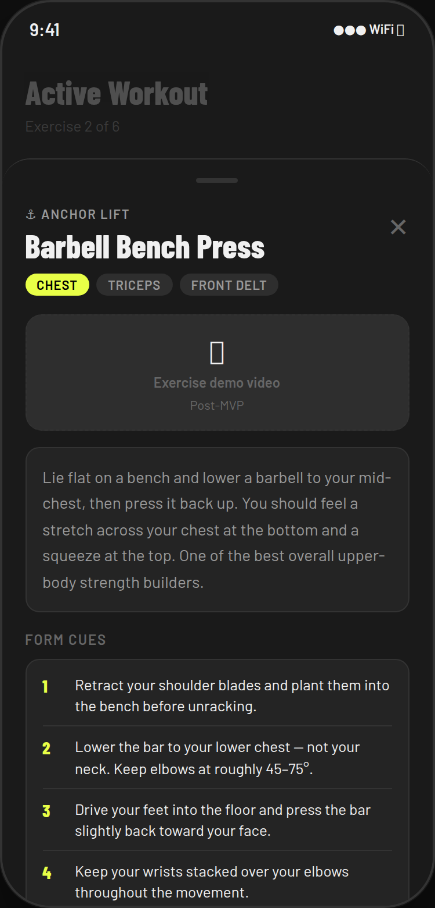
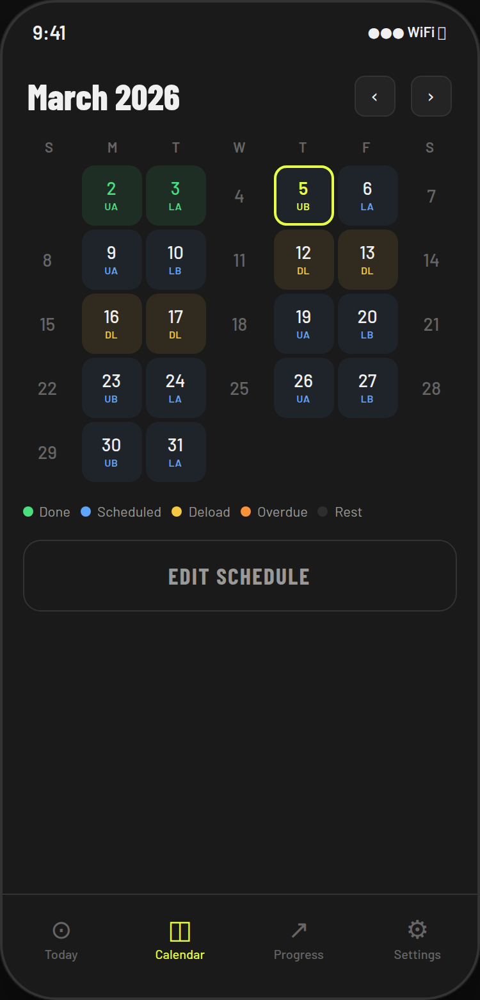
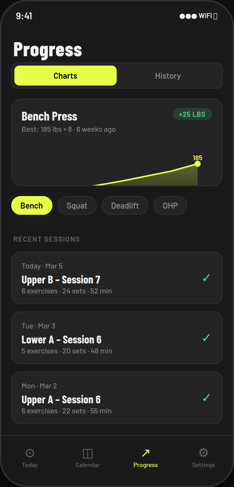

# IronLog

A personal iOS strength training app built with SwiftUI and SwiftData. Designed to feel like a native Apple app — dark, minimal, and fast.

> Built as a personal project and portfolio piece. Runs on iPhone via Sideloadly or the App Store (pending submission).

---

## Screenshots

<p float="left">
  
  
  
  
  
</p>
<p float="left">
  
  
</p>

---

## Features

### Workout Tracking
- **Active workout screen** — log sets with weight, reps, and RPE; swipe left/right between exercises
- **Rest timer** — auto-starts after each set, runs in the background, fires a notification when complete with haptic feedback
- **Set editing** — inline edit or delete any logged set mid-workout
- **Extra sets** — add sets beyond the template target at any time
- **Crash recovery** — workout progress is autosaved to disk after every set; resumable after force-quit

### Programs
- **7 built-in programs** — Upper/Lower, Push/Pull/Legs, Full Body, Muscle Group Split, Stronglifts 5×5, Arnold Split, PHUL
- **Program browser** — browse all programs with descriptions, session previews, and tags; switch or bolt on individual sessions
- **Add muscle groups** — natively add Core, Arms, Glutes, or Calves to any existing sessions with one tap

### Intelligence
- **Progressive overload engine** — recommends weight increases based on prior session performance
- **PR detection** — flags new personal records at session end
- **Stall detection** — identifies exercises with no progress across 3+ consecutive sessions
- **Deload support** — suggests and applies deload weights automatically
- **Absence detection** — prompts for a calibration reset after 14+ days away

### Health & Notifications
- **Apple Health integration** — writes completed workouts (type, duration, calories) to HealthKit; reads body mass for accurate calorie estimates
- **Local notifications** — scheduled session reminders and rest timer alerts

### Exercise Library
- **38 exercises** with stable UUIDs, tier classification (Anchor / Secondary / Accessory), form cues, primary/secondary muscles, and suggested starting weights
- **Browsable library tab** — filter by muscle group and tier; tap any exercise for full details; add to any session

### Calendar & History
- **Monthly calendar** — visualises scheduled and completed sessions; tap any day to view or edit
- **Queue editor** — drag to reorder upcoming sessions, mark as skipped, reschedule
- **Progress charts** — per-exercise volume and weight trends using Swift Charts
- **Session history** — full set breakdown for every completed workout

---

## Tech Stack

| Area | Technology |
|------|-----------|
| UI | SwiftUI |
| Persistence | SwiftData |
| Charts | Swift Charts |
| Health | HealthKit |
| Notifications | UserNotifications |
| Project generation | XcodeGen |
| CI / Build | Codemagic |
| Language | Swift 5.9, iOS 17+ |

---

## Architecture

```
IronLog/
├── App/
│   ├── IronLogApp.swift          # SwiftData container, @main
│   ├── RootView.swift            # Onboarding gate
│   └── MainTabView.swift         # 5-tab shell
│
├── Models/                       # SwiftData @Model classes
│   ├── Exercise.swift
│   ├── Program.swift
│   ├── SessionTemplate.swift     # + TemplateEntry
│   ├── QueuedSession.swift
│   ├── WorkoutLog.swift
│   └── SetLog.swift
│
├── Data/
│   ├── ExerciseLibrary.swift     # 38 exercises with stable UUIDs
│   ├── ProgramLibrary.swift      # 7 program definitions
│   └── DataSeeder.swift          # Diff-insert on launch (never duplicates)
│
├── Services/
│   ├── ProgramGenerator.swift    # Builds templates + rolling session queue
│   ├── ProgressionEngine.swift   # Overload, stall, PR, deload, absence
│   ├── HealthKitManager.swift    # Read body mass, write workouts
│   └── NotificationManager.swift # Session reminders + rest timer alerts
│
├── Theme/
│   └── AppTheme.swift            # Colors, typography, spacing, card modifiers
│
└── Views/
    ├── Onboarding/               # 6-step flow — days, injuries, time away, body stats
    ├── Home/                     # Today's session card, program row
    ├── Programs/                 # ProgramBrowserView, ProgramDetailView, AddMuscleGroupView
    ├── Session/                  # DailySessionView, ActiveWorkoutView, SessionCompleteView
    ├── Exercises/                # ExerciseLibraryView with search and filters
    ├── Calendar/                 # CalendarView, QueueEditorView
    ├── Progress/                 # Charts, session history
    ├── Settings/                 # Units, body stats, danger zone
    └── Shared/                   # ExerciseInfoSheet, ExerciseSwapView, prompts
```

---

## Key Design Decisions

- **All-local, no backend.** Everything lives in SwiftData on device. No accounts, no sync, no subscriptions.
- **Stable exercise UUIDs.** Exercise IDs are constants in `ExerciseLibrary`, not generated at runtime, so templates, set logs, and charts always cross-reference correctly across installs.
- **Queue-based scheduling.** Sessions are pre-generated into a `QueuedSession` queue. Missed days stay at position 1 — nothing auto-skips silently.
- **Diff-insert seeding.** `DataSeeder` compares existing exercise UUIDs against the full catalog and only inserts new ones, so existing users get new exercises without losing data.
- **Weights stored in lbs internally.** The units toggle in Settings is display-only — no conversion bugs from storing mixed units.
- **Crash-safe workout logging.** Every set is written to `UserDefaults` immediately. On relaunch the session is restored from the draft before the user can tap anything.

---

## Running Locally

Requires a Mac with Xcode 15+ and [XcodeGen](https://github.com/yonaskolb/XcodeGen).

```bash
git clone https://github.com/danielnnsc/IronLog.git
cd IronLog
chmod +x setup.sh && ./setup.sh
```

The script installs XcodeGen (via Homebrew if needed), generates `IronLog.xcodeproj`, and offers to open it in Xcode. Select an iPhone simulator running iOS 17+ and press `Cmd+R`.
